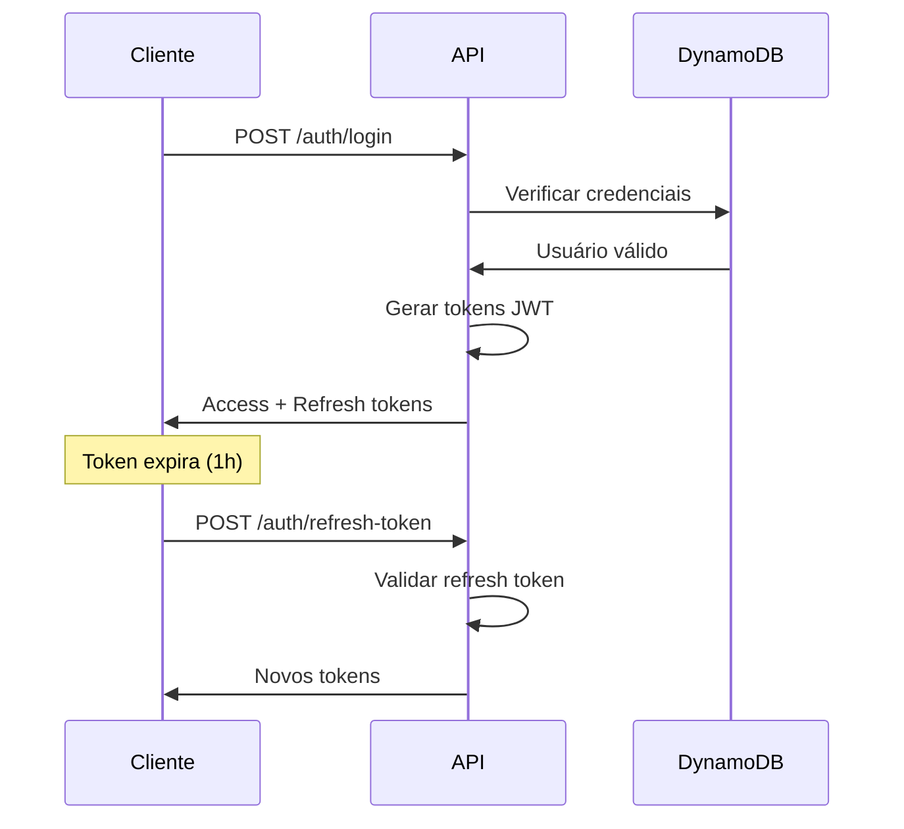

# 🔐 Sistema de Autenticação

## Visão Geral

Sistema robusto de autenticação baseado em JWT (JSON Web Tokens) com suporte a refresh tokens e controle de acesso baseado em roles.

## Características

- ✅ **JWT Access Tokens** (1 hora de duração)
- ✅ **Refresh Tokens** (7 dias de duração)  
- ✅ **Sistema de Roles** (admin, atendimento, lavagem, pintura)
- ✅ **Hash seguro de senhas** (bcrypt)
- ✅ **Middleware de autenticação** automático
- ✅ **Validação de permissões** por endpoint

## Fluxo de Autenticação



## Endpoints de Autenticação

### 🔑 Registro de Usuário

**Endpoint:** `POST /auth/register`

**Descrição:** Registra um novo usuário no sistema.

**Headers:**
```json
{
  "Content-Type": "application/json"
}
```

**Body:**
```json
{
  "email": "admin@loja.com",
  "password": "minhasenha123",
  "role": "admin",
  "name": "Administrador do Sistema"
}
```

**Validações:**
- Email deve ser único
- Senha mínima de 6 caracteres
- Role deve ser: `admin`, `atendimento`, `lavagem`, `pintura`
- Nome é obrigatório

**Response (201 - Sucesso):**
```json
{
  "success": true,
  "message": "Usuário registrado com sucesso",
  "user": {
    "id": "user-123e4567-e89b-12d3",
    "email": "admin@loja.com",
    "role": "admin", 
    "name": "Administrador do Sistema",
    "createdAt": "2024-10-03T10:30:00.000Z"
  }
}
```

**Response (400 - Email já existe):**
```json
{
  "success": false,
  "error": "Email já está em uso"
}
```

### 🚪 Login

**Endpoint:** `POST /auth/login`

**Descrição:** Autentica usuário e retorna tokens de acesso.

**Body:**
```json
{
  "email": "admin@loja.com",
  "password": "minhasenha123"
}
```

**Response (200 - Sucesso):**
```json
{
  "success": true,
  "token": "eyJhbGciOiJIUzI1NiIsInR5cCI6IkpXVCJ9...",
  "refreshToken": "eyJhbGciOiJIUzI1NiIsInR5cCI6IkpXVCJ9...",
  "user": {
    "id": "user-123e4567-e89b-12d3",
    "email": "admin@loja.com",
    "role": "admin",
    "name": "Administrador do Sistema"
  }
}
```

**Response (401 - Credenciais inválidas):**
```json
{
  "success": false,
  "error": "Email ou senha incorretos"
}
```

### 🔄 Refresh Token

**Endpoint:** `POST /auth/refresh-token`

**Descrição:** Renova o access token usando refresh token válido.

**Body:**
```json
{
  "refreshToken": "eyJhbGciOiJIUzI1NiIsInR5cCI6IkpXVCJ9..."
}
```

**Response (200 - Sucesso):**
```json
{
  "success": true,
  "token": "eyJhbGciOiJIUzI1NiIsInR5cCI6IkpXVCJ9...",
  "refreshToken": "eyJhbGciOiJIUzI1NiIsInR5cCI6IkpXVCJ9..."
}
```

**Response (401 - Refresh token inválido):**
```json
{
  "success": false,
  "error": "Refresh token inválido ou expirado"
}
```

## Sistema de Roles e Permissões

### Roles Disponíveis:

#### 🔧 Admin
- **Descrição:** Acesso total ao sistema
- **Permissões:**
  - Ver todos os pedidos e status
  - Criar/editar/excluir pedidos
  - Gerenciar clientes
  - Alterar qualquer status de pedido
  - Acessar dashboard completo
  - Upload de arquivos

#### 👥 Atendimento  
- **Descrição:** Responsável pelo atendimento ao cliente
- **Permissões:**
  - Ver todos os pedidos (acompanhamento)
  - Criar novos pedidos
  - Gerenciar clientes
  - Alterar status: `Atendimento - *`
  - Upload de arquivos
  - Gerar PDFs

#### 🧽 Lavagem
- **Descrição:** Setor de lavagem de calçados
- **Permissões:**
  - Ver pedidos: `Lavagem - *` + `Atendimento - Aprovado`
  - Alterar status: `Lavagem - *`
  - Upload de arquivos
  - Dashboard filtrado

#### 🎨 Pintura
- **Descrição:** Setor de pintura e customização
- **Permissões:**
  - Ver pedidos: `Pintura - *` + `Lavagem - Concluído`
  - Alterar status: `Pintura - *`
  - Upload de arquivos
  - Dashboard filtrado

## Middleware de Autenticação

### authMiddleware.js

```javascript
const jwt = require('jsonwebtoken');

const authMiddleware = (req, res, next) => {
  try {
    const authHeader = req.headers.authorization;
    
    if (!authHeader) {
      return res.status(401).json({
        success: false,
        error: 'Token de acesso requerido'
      });
    }

    const token = authHeader.split(' ')[1]; // Remove 'Bearer '
    
    if (!token) {
      return res.status(401).json({
        success: false,
        error: 'Formato de token inválido'
      });
    }

    const decoded = jwt.verify(token, process.env.JWT_SECRET);
    req.user = decoded;
    next();
    
  } catch (error) {
    return res.status(401).json({
      success: false,
      error: 'Token inválido ou expirado'
    });
  }
};
```

### Como Usar:

```javascript
// Proteger rota específica
router.get('/pedidos', authMiddleware, pedidoController.listPedidos);

// Proteger todas as rotas de um módulo
router.use(authMiddleware);
```

## Validação de Permissões por Status

### Sistema Automático:

```javascript
// Exemplo em pedidoController.js
const canUpdateStatus = (userRole, newStatus) => {
  switch (userRole?.toLowerCase()) {
    case 'admin':
      return true; // Admin pode alterar qualquer status
      
    case 'lavagem':
      return newStatus.startsWith('Lavagem - ');
      
    case 'pintura':
      return newStatus.startsWith('Pintura - ');
      
    case 'atendimento':
      return newStatus.startsWith('Atendimento - ');
      
    default:
      return false;
  }
};

// Uso na validação
if (!canUpdateStatus(req.user.role, newStatus)) {
  return res.status(403).json({
    success: false,
    error: 'Usuário não tem permissão para alterar para este status'
  });
}
```

## Configuração de Tokens

### Variáveis de Ambiente:

```bash
# Chaves secretas (use valores seguros em produção)
JWT_SECRET=sua-chave-secreta-super-forte-aqui
JWT_REFRESH_SECRET=sua-chave-refresh-ainda-mais-forte

# Tempos de expiração
JWT_EXPIRES_IN=1h
JWT_REFRESH_EXPIRES_IN=7d
```

### Estrutura do Token JWT:

```json
{
  "header": {
    "alg": "HS256",
    "typ": "JWT"
  },
  "payload": {
    "sub": "user-123e4567-e89b-12d3",
    "email": "admin@loja.com",
    "role": "admin",
    "name": "Administrador do Sistema",
    "iat": 1696147200,
    "exp": 1696150800
  }
}
```

## Filtros por Role

### GET /pedidos/kanban/status:

```javascript
// Filtro automático baseado no role
switch (role?.toLowerCase()) {
  case 'admin':
    // Admin vê todos os pedidos
    break;
    
  case 'lavagem':
    pedidos = pedidos.filter(p => 
      p.status?.startsWith('Lavagem - ') || 
      p.status === 'Atendimento - Aprovado'
    );
    break;
    
  case 'pintura':
    pedidos = pedidos.filter(p => 
      p.status?.startsWith('Pintura - ') || 
      p.status === 'Lavagem - Concluído'
    );
    break;
    
  case 'atendimento':
    // Atendimento vê todos (para acompanhamento)
    break;
}
```

## Segurança

### Boas Práticas Implementadas:

1. **Senhas Hasheadas:** Uso do bcrypt para hash seguro
2. **Tokens com Expiração:** Access tokens de curta duração (1h)
3. **Refresh Tokens:** Renovação segura sem re-autenticação
4. **Validação Rigorosa:** Verificação de formato e assinatura dos tokens
5. **Controle Granular:** Permissões específicas por role e endpoint
6. **Headers Seguros:** Uso do cabeçalho Authorization padrão

### Tratamento de Erros:

```javascript
// Exemplo de middleware com tratamento completo
const authMiddleware = (req, res, next) => {
  try {
    // ... validações
    
  } catch (error) {
    if (error.name === 'TokenExpiredError') {
      return res.status(401).json({
        success: false,
        error: 'Token expirado',
        code: 'TOKEN_EXPIRED'
      });
    }
    
    if (error.name === 'JsonWebTokenError') {
      return res.status(401).json({
        success: false,
        error: 'Token inválido',
        code: 'INVALID_TOKEN'
      });
    }
    
    return res.status(500).json({
      success: false,
      error: 'Erro interno de autenticação'
    });
  }
};
```

## Exemplos de Uso

### 1. Login e Uso do Token:

```bash
# 1. Fazer login
curl -X POST https://api.shoerepair.com/dev/auth/login \
  -H "Content-Type: application/json" \
  -d '{
    "email": "admin@loja.com",
    "password": "123456"
  }'

# Response: { "token": "eyJhbGci...", "refreshToken": "..." }

# 2. Usar token em requisição protegida
curl -X GET https://api.shoerepair.com/dev/pedidos \
  -H "Authorization: Bearer eyJhbGci..."
```

### 2. Renovar Token:

```bash
# Quando o access token expira
curl -X POST https://api.shoerepair.com/dev/auth/refresh-token \
  -H "Content-Type: application/json" \
  -d '{
    "refreshToken": "eyJhbGci..."
  }'
```

### 3. Registrar Novo Usuário:

```bash
curl -X POST https://api.shoerepair.com/dev/auth/register \
  -H "Content-Type: application/json" \
  -d '{
    "email": "funcionario@loja.com",
    "password": "senha123",
    "role": "lavagem",
    "name": "João da Lavagem"
  }'
```

---

**Arquivos Relacionados:**
- `src/controllers/authController.js`
- `src/middleware/authMiddleware.js` 
- `src/routes/authRoutes.js`
- `src/services/userService.js`