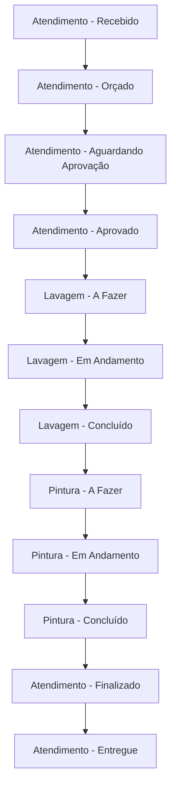

# 👟 Sistema de Pedidos

## Visão Geral

Módulo central do sistema responsável pelo gerenciamento completo de pedidos de reparo de calçados, incluindo criação, acompanhamento, atualização de status e geração de documentos.

## Características Principais

- ✅ **IDs Únicos** no formato `MMDDYYYYXXXX` (ex: `10032024AB1C`)
- ✅ **Sistema de Status** com histórico completo
- ✅ **Serviços Múltiplos** por pedido
- ✅ **Valores Financeiros** (total, sinal, restante)
- ✅ **Garantia** configurável
- ✅ **Upload de Fotos** integrado
- ✅ **Geração de PDF** automática
- ✅ **Notificações WhatsApp** por mudança de status
- ✅ **Filtros por Role** para controle de acesso

## Estados do Pedido

### Fluxo Completo:



### Status por Departamento:

#### 🏢 Atendimento:
- `Atendimento - Recebido`
- `Atendimento - Orçado`
- `Atendimento - Aguardando Aprovação` ⭐ (Status padrão)
- `Atendimento - Aprovado`
- `Atendimento - Finalizado`
- `Atendimento - Entregue`

#### 🧽 Lavagem:
- `Lavagem - A Fazer`
- `Lavagem - Em Andamento`
- `Lavagem - Concluído`

#### 🎨 Pintura:
- `Pintura - A Fazer`
- `Pintura - Em Andamento`  
- `Pintura - Concluído`

## Endpoints

### 📋 Listar Pedidos

#### `GET /pedidos`
Lista todos os pedidos (formato básico).

**Autenticação:** Requerida  
**Permissões:** Todas as roles

**Response:**
```json
[
  {
    "id": "10032024AB1C",
    "clienteId": "cliente-123",
    "clientName": "João Silva",
    "modeloTenis": "Nike Air Max 270",
    "status": "Lavagem - Em Andamento",
    "precoTotal": 180.50,
    "dataCriacao": "2024-10-03T10:30:00.000Z"
  }
]
```

#### `GET /pedidos/kanban/status`
Lista pedidos formatados para kanban com filtros por role.

**Autenticação:** Requerida  
**Filtros Automáticos:**
- **Admin/Atendimento:** Vê todos os pedidos
- **Lavagem:** Pedidos `Lavagem - *` + `Atendimento - Aprovado`  
- **Pintura:** Pedidos `Pintura - *` + `Lavagem - Concluído`

**Response:**
```json
{
  "success": true,
  "data": [
    {
      "id": "10032024AB1C",
      "clientName": "João Silva Santos",
      "clientCpf": "123.456.789-10",
      "sneaker": "Nike Air Max 270",
      "serviceType": "Lavagem e Pintura", 
      "servicos": "Lavagem completa, Pintura personalizada, Troca de cadarço",
      "status": "Lavagem - Em Andamento",
      "createdDate": "2024-10-01",
      "expectedDate": "2024-10-08",
      "precoTotal": 180.50,
      "valorSinal": 50.00,
      "valorRestante": 130.50,
      "garantia": {
        "ativa": true,
        "preco": 25.00,
        "duracao": "6 meses",
        "data": "2024-10-08"
      },
      "acessorios": ["Cadarço Nike original", "Spray impermeabilizante"],
      "fotos": ["https://s3.amazonaws.com/foto1.jpg"],
      "observacoes": "Cliente solicitou cores específicas",
      "statusHistory": [...]
    }
  ]
}
```

### 🔍 Obter Pedido Específico

#### `GET /pedidos/:id`

**Parâmetros:**
- `id`: ID do pedido (ex: `10032024AB1C`)

**Response:**
```json
{
  "id": "10032024AB1C",
  "clienteId": "cliente-123",
  "clientName": "João Silva Santos",
  "modeloTenis": "Nike Air Max 270",
  "servicos": [
    {
      "id": "servico-1",
      "nome": "Lavagem completa", 
      "preco": 45.00,
      "descricao": "Lavagem com produtos especiais"
    },
    {
      "id": "servico-2",
      "nome": "Pintura personalizada",
      "preco": 135.50, 
      "descricao": "Pintura em cores personalizadas"
    }
  ],
  "fotos": [
    "https://s3.amazonaws.com/User/cliente-123/fotos/foto1.jpg",
    "https://s3.amazonaws.com/User/cliente-123/fotos/foto2.jpg"
  ],
  "precoTotal": 180.50,
  "valorSinal": 50.00,
  "valorRestante": 130.50,
  "dataPrevistaEntrega": "2024-10-08",
  "departamento": "Lavagem",
  "observacoes": "Cliente solicitou cores específicas: azul royal e branco",
  "garantia": {
    "ativa": true,
    "preco": 25.00,
    "duracao": "6 meses",
    "data": "2024-10-08"
  },
  "acessorios": [
    "Cadarço Nike original branco",
    "Spray impermeabilizante"
  ],
  "status": "Lavagem - Em Andamento",
  "statusHistory": [
    {
      "status": "Atendimento - Aguardando Aprovação",
      "date": "2024-10-01",
      "time": "09:15",
      "userId": "user-456",
      "userName": "maria@loja.com",
      "timestamp": "2024-10-01T12:15:30.000Z"
    },
    {
      "status": "Atendimento - Aprovado",
      "date": "2024-10-01", 
      "time": "14:30",
      "userId": "user-456",
      "userName": "maria@loja.com",
      "timestamp": "2024-10-01T17:30:45.000Z"
    },
    {
      "status": "Lavagem - Em Andamento",
      "date": "2024-10-02",
      "time": "08:45", 
      "userId": "user-789",
      "userName": "carlos@loja.com",
      "timestamp": "2024-10-02T11:45:20.000Z"
    }
  ],
  "dataCriacao": "2024-10-01T12:15:30.000Z",
  "createdAt": "2024-10-01T12:15:30.000Z",
  "updatedAt": "2024-10-02T11:45:20.000Z"
}
```

### ➕ Criar Novo Pedido

#### `POST /pedidos`

**Autenticação:** Requerida  
**Permissões:** `admin`, `atendimento`

**Body:**
```json
{
  "clienteId": "cliente-123",
  "clientName": "João Silva Santos",
  "modeloTenis": "Nike Air Max 270",
  "servicos": [
    {
      "id": "servico-1",
      "nome": "Lavagem completa",
      "preco": 45.00,
      "descricao": "Lavagem com produtos especiais"
    },
    {
      "id": "servico-2", 
      "nome": "Pintura personalizada",
      "preco": 135.50,
      "descricao": "Pintura em cores personalizadas"
    }
  ],
  "fotos": [
    "https://s3.amazonaws.com/uploads/foto1.jpg",
    "https://s3.amazonaws.com/uploads/foto2.jpg"
  ],
  "precoTotal": 180.50,
  "valorSinal": 50.00,
  "valorRestante": 130.50,
  "dataPrevistaEntrega": "2024-10-08",
  "departamento": "Atendimento",
  "observacoes": "Cliente solicitou cores específicas: azul royal e branco",
  "garantia": {
    "ativa": true,
    "preco": 25.00,
    "duracao": "6 meses",
    "data": "2024-10-08"
  },
  "acessorios": [
    "Cadarço Nike original branco", 
    "Spray impermeabilizante"
  ]
}
```

**Validações:**
- `clienteId`: Obrigatório
- `clientName`: Obrigatório
- `modeloTenis`: Obrigatório
- `servicos`: Array obrigatório, não vazio
- Cada serviço deve ter: `id`, `nome`, `preco` (number)
- Se `garantia` fornecida: `ativa` (boolean) e `preco` (number) obrigatórios

**Response (201):**
```json
{
  "success": true,
  "data": {
    "id": "10032024AB1C",  // ID gerado automaticamente
    "clienteId": "cliente-123",
    "clientName": "João Silva Santos",
    "status": "Atendimento - Aguardando Aprovação",  // Status padrão
    "statusHistory": [{
      "status": "Atendimento - Aguardando Aprovação",
      "date": "2024-10-03",
      "time": "10:30",
      "userId": "user-456", 
      "userName": "maria@loja.com"
    }],
    // ... todos os demais campos
  },
  "message": "Pedido criado com sucesso"
}
```

### ✏️ Atualizar Pedido

#### `PUT /pedidos/:id`
Atualização completa do pedido.

**Autenticação:** Requerida  
**Permissões:** `admin`, `atendimento`  
**Body:** Mesmo formato do POST

#### `PATCH /pedidos/:id`
Atualização parcial com validação de permissões.

**Autenticação:** Requerida  
**Permissões:** Baseada nos campos alterados

**Campos Permitidos:**
- `modeloTenis`, `servicos`, `fotos`, `precoTotal`
- `dataPrevistaEntrega`, `departamento`, `observacoes`
- `status`, `tipoServico`, `descricaoServicos`, `preco`
- `statusHistory`

**Body (exemplo):**
```json
{
  "status": "Lavagem - Concluído",
  "observacoes": "Lavagem finalizada com sucesso. Produto pronto para pintura."
}
```

**Validação de Status:**
- **Admin:** Pode alterar qualquer status
- **Atendimento:** Apenas `Atendimento - *`
- **Lavagem:** Apenas `Lavagem - *` 
- **Pintura:** Apenas `Pintura - *`

**Response (200):**
```json
{
  "success": true,
  "data": {
    "id": "10032024AB1C",
    // ... pedido atualizado
  },
  "message": "Pedido atualizado com sucesso. Campos alterados: status, observacoes"
}
```

### 🔄 Atualizar Status

#### `PATCH /pedidos/:id/status`
Atualização específica de status com histórico automático.

**Autenticação:** Requerida  
**Permissões:** Baseada no status de destino

**Body:**
```json
{
  "status": "Lavagem - Concluído"
}
```

**Funcionalidades Automáticas:**
1. **Validação de Permissão** baseada no role
2. **Histórico Automático** com timestamp e usuário
3. **Notificação WhatsApp** (se configurado)
4. **Atualização de `updatedAt`**

**Response (200):**
```json
{
  "success": true,
  "data": {
    "id": "10032024AB1C",
    "status": "Lavagem - Concluído",
    "statusHistory": [
      // ... histórico anterior
      {
        "status": "Lavagem - Concluído",
        "date": "2024-10-03",
        "time": "15:30",
        "userId": "user-789",
        "userName": "carlos@loja.com",
        "timestamp": "2024-10-03T18:30:00.000Z"
      }
    ],
    "updatedAt": "2024-10-03T18:30:00.000Z"
  },
  "message": "Status atualizado com sucesso"
}
```

### 🗑️ Excluir Pedido

#### `DELETE /pedidos/:id`

**Autenticação:** Requerida  
**Permissões:** `admin`, `atendimento`

**Response (200):**
```json
{
  "deleted": true
}
```

## 📄 Geração de PDFs

### `POST /pedidos/document/pdf`
Gerar PDF do pedido para download.

**Autenticação:** Requerida

**Body:**
```json
{
  "pedidoId": "10032024AB1C"
}
```

**Response (200):**
```
Content-Type: application/pdf
Content-Disposition: attachment; filename="pedido-10032024AB1C.pdf"
Content-Length: 245760
X-S3-URL: https://bucket.s3.amazonaws.com/User/cliente-123/pedidos/10032024AB1C/pdf/pedido.pdf
X-S3-Key: User/cliente-123/pedidos/10032024AB1C/pdf/pedido.pdf

[Binary PDF Data]
```

**Características do PDF:**
- ✅ **Logo da empresa** (se configurado)
- ✅ **Dados do cliente** completos
- ✅ **Detalhes do pedido** (serviços, valores, garantia)
- ✅ **Histórico de status** completo
- ✅ **QR Code** com link para acompanhamento
- ✅ **Salvo automaticamente** no S3

### `GET /pedidos/:id/pdfs`
Listar PDFs salvos do pedido no S3.

**Response (200):**
```json
{
  "success": true,
  "data": {
    "pedidoId": "10032024AB1C",
    "clienteId": "cliente-123",
    "pdfs": [
      {
        "key": "User/cliente-123/pedidos/10032024AB1C/pdf/pedido.pdf",
        "lastModified": "2024-10-03T15:30:00.000Z",
        "size": 245760,
        "url": "https://bucket.s3.amazonaws.com/User/cliente-123/pedidos/10032024AB1C/pdf/pedido.pdf",
        "filename": "pedido.pdf"
      }
    ]
  }
}
```

## 🔤 Sistema de IDs

### Formato: `MMDDYYYYXXXX`

**Exemplo:** `10032024AB1C`
- `10` = Mês (outubro)
- `03` = Dia  
- `2024` = Ano
- `AB1C` = 4 caracteres alfanuméricos aleatórios

### Geração Automática:

```javascript
function gerarIdPedido() {
  const now = new Date();
  const mes = String(now.getMonth() + 1).padStart(2, '0');
  const dia = String(now.getDate()).padStart(2, '0'); 
  const ano = String(now.getFullYear());
  const chars = 'ABCDEFGHIJKLMNOPQRSTUVWXYZ0123456789';
  
  let aleatorio = '';
  for (let i = 0; i < 4; i++) {
    aleatorio += chars.charAt(Math.floor(Math.random() * chars.length));
  }
  
  return `${mes}${dia}${ano}${aleatorio}`;
}
```

**Características:**
- ✅ **Único por execução** (probabilidade de colisão muito baixa)
- ✅ **Data identificável** visualmente
- ✅ **Compatível** com sistemas externos
- ✅ **Memorável** para clientes

## 💰 Sistema Financeiro

### Estrutura de Valores:

```json
{
  "servicos": [
    {
      "id": "servico-1",
      "nome": "Lavagem completa",
      "preco": 45.00
    },
    {
      "id": "servico-2", 
      "nome": "Pintura personalizada",
      "preco": 135.50
    }
  ],
  "precoTotal": 180.50,        // Soma dos serviços
  "valorSinal": 50.00,         // Valor pago como entrada
  "valorRestante": 130.50,     // Valor a receber
  "garantia": {
    "ativa": true,
    "preco": 25.00,            // Valor adicional da garantia
    "duracao": "6 meses",
    "data": "2024-10-08"       // Data de vencimento
  }
}
```

### Cálculos Automáticos:

1. **Preço Total:** Soma automática dos serviços (se não fornecido)
2. **Valor Restante:** `precoTotal - valorSinal` (se não fornecido)
3. **Garantia:** Valor adicional não incluído no preço total

## 🔔 Notificações WhatsApp

### Ativação Automática:
- **Quando:** Status do pedido é alterado
- **Condição:** Pedido tem `telefoneCliente` e `nomeCliente`
- **Conteúdo:** Status atual, nome do cliente, descrição dos serviços

### Exemplo de Mensagem:
```
🔔 Atualização do seu pedido

Olá João Silva!

Status atual: Lavagem - Concluído
Serviços: Lavagem completa, Pintura personalizada  
Tênis: Nike Air Max 270

Em breve entraremos em contato para próximas etapas.

Shoe Repair LTDA
```

### Tratamento de Erros:
- ✅ **Não bloqueia** a atualização do pedido
- ✅ **Log de erro** para debugging  
- ✅ **Continua operação** normalmente

## 📊 Filtros por Role

### Implementação Automática:

```javascript
// Em listPedidosStatus()
switch (role?.toLowerCase()) {
  case 'admin':
    // Admin vê todos os pedidos
    break;
    
  case 'lavagem':
    pedidos = pedidos.filter(p => 
      p.status?.startsWith('Lavagem - ') || 
      p.status === 'Atendimento - Aprovado'
    );
    break;
    
  case 'pintura':
    pedidos = pedidos.filter(p => 
      p.status?.startsWith('Pintura - ') || 
      p.status === 'Lavagem - Concluído'
    );
    break;
    
  case 'atendimento':
    // Atendimento vê todos (para acompanhamento)
    break;
}
```

### Lógica de Visibilidade:

| Role | Pedidos Visíveis |
|------|------------------|
| **Admin** | Todos os pedidos |
| **Atendimento** | Todos os pedidos (acompanhamento) |
| **Lavagem** | `Lavagem - *` + `Atendimento - Aprovado` |
| **Pintura** | `Pintura - *` + `Lavagem - Concluído` |

## 🚀 Exemplos de Uso

### 1. Fluxo Completo de Pedido:

```bash
# 1. Upload das fotos
curl -X POST https://api.shoerepair.com/dev/upload/fotos \
  -H "Authorization: Bearer <token>" \
  -F "fotos=@tenis_antes1.jpg" \
  -F "fotos=@tenis_antes2.jpg"

# 2. Criar pedido
curl -X POST https://api.shoerepair.com/dev/pedidos \
  -H "Authorization: Bearer <token>" \
  -H "Content-Type: application/json" \
  -d '{
    "clienteId": "cliente-123",
    "clientName": "João Silva",
    "modeloTenis": "Nike Air Max",
    "servicos": [
      {
        "id": "servico-1",
        "nome": "Lavagem completa", 
        "preco": 45.00,
        "descricao": "Lavagem profissional"
      }
    ],
    "fotos": ["https://s3.amazonaws.com/foto1.jpg"],
    "precoTotal": 45.00,
    "valorSinal": 20.00,
    "dataPrevistaEntrega": "2024-10-10"
  }'

# 3. Atualizar status (role: lavagem)
curl -X PATCH https://api.shoerepair.com/dev/pedidos/10032024AB1C/status \
  -H "Authorization: Bearer <token>" \
  -H "Content-Type: application/json" \
  -d '{"status": "Lavagem - Em Andamento"}'

# 4. Gerar PDF
curl -X POST https://api.shoerepair.com/dev/pedidos/document/pdf \
  -H "Authorization: Bearer <token>" \
  -H "Content-Type: application/json" \
  -d '{"pedidoId": "10032024AB1C"}' \
  --output pedido.pdf
```

### 2. Buscar Pedidos por Status:

```bash
# Listar pedidos (filtrado automaticamente por role)
curl -X GET https://api.shoerepair.com/dev/pedidos/kanban/status \
  -H "Authorization: Bearer <token>"

# Resultado para role "lavagem":
# Apenas pedidos "Lavagem - *" e "Atendimento - Aprovado"
```

### 3. Atualização com Validação:

```bash
# ❌ Tentativa inválida (role: lavagem tentando alterar status de pintura)
curl -X PATCH https://api.shoerepair.com/dev/pedidos/10032024AB1C/status \
  -H "Authorization: Bearer <token>" \
  -d '{"status": "Pintura - Concluído"}'

# Response: 403 Forbidden
# "Usuário não tem permissão para alterar para este status"

# ✅ Tentativa válida
curl -X PATCH https://api.shoerepair.com/dev/pedidos/10032024AB1C/status \
  -H "Authorization: Bearer <token>" \
  -d '{"status": "Lavagem - Concluído"}'

# Response: 200 OK + Histórico atualizado
```

---

**Arquivos Relacionados:**
- `src/controllers/pedidoController.js`
- `src/services/pedidoService.js`
- `src/routes/pedidoRoutes.js`
- `src/models/pedidoModel.js`
- `src/services/pdfService.js`
- `src/services/whatsappService.js`